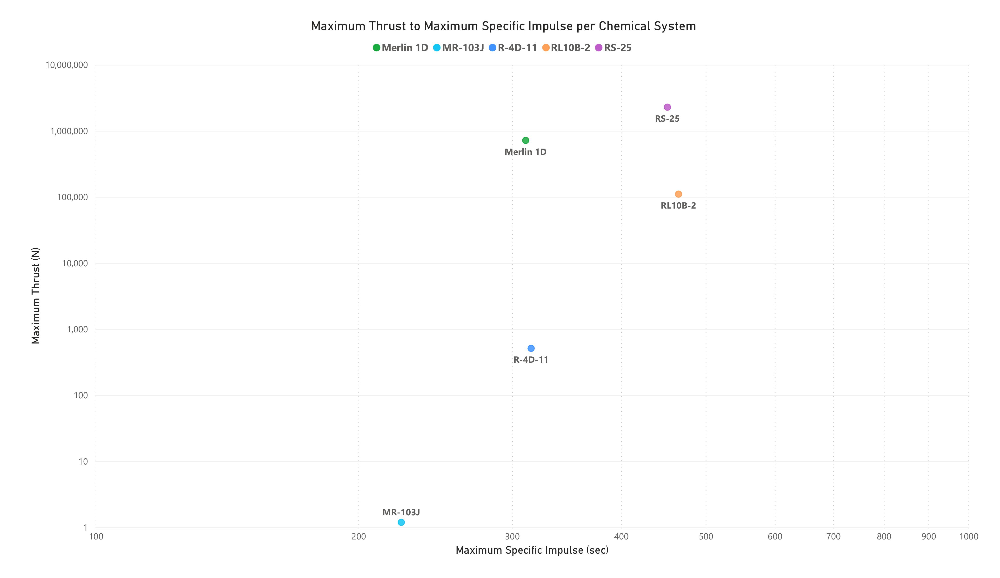
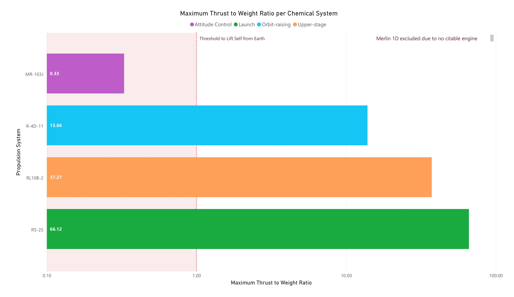
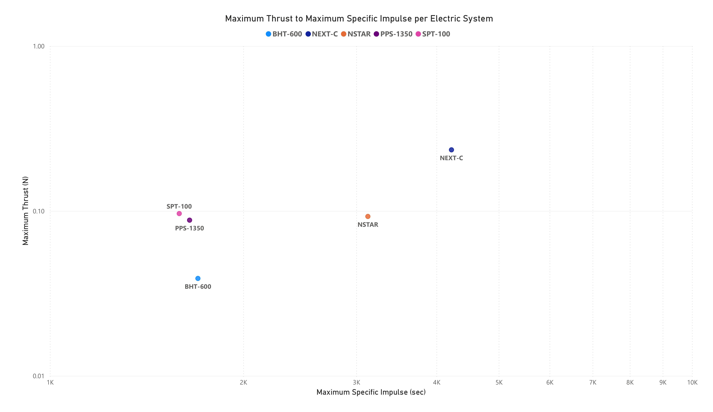
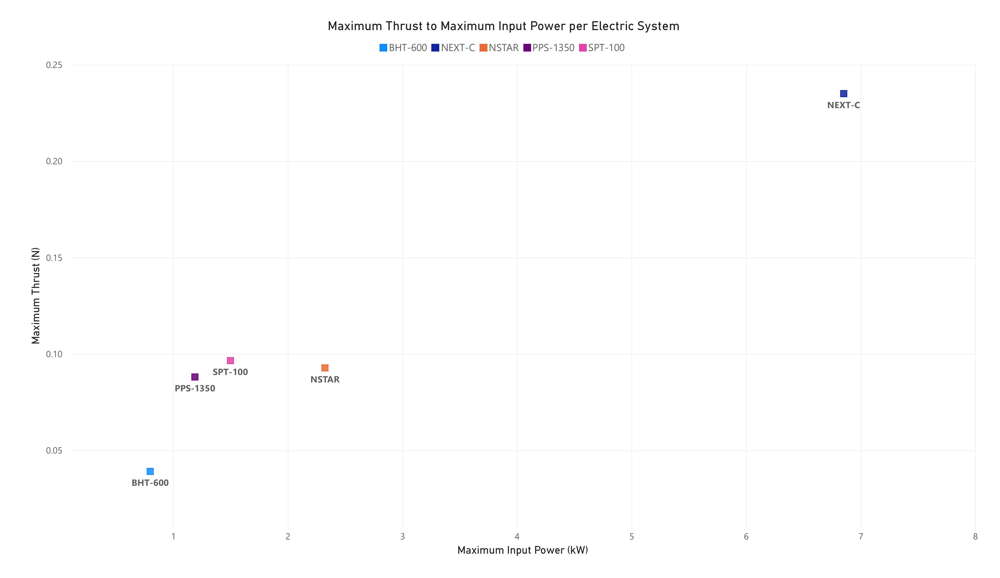
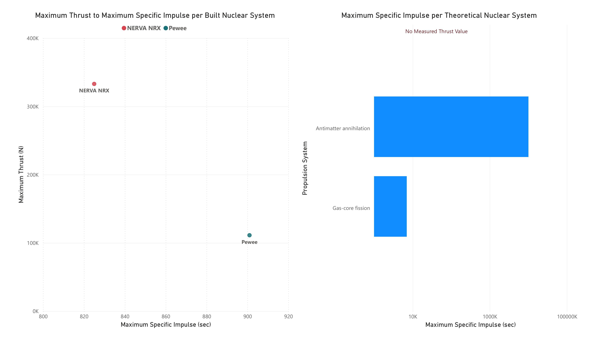
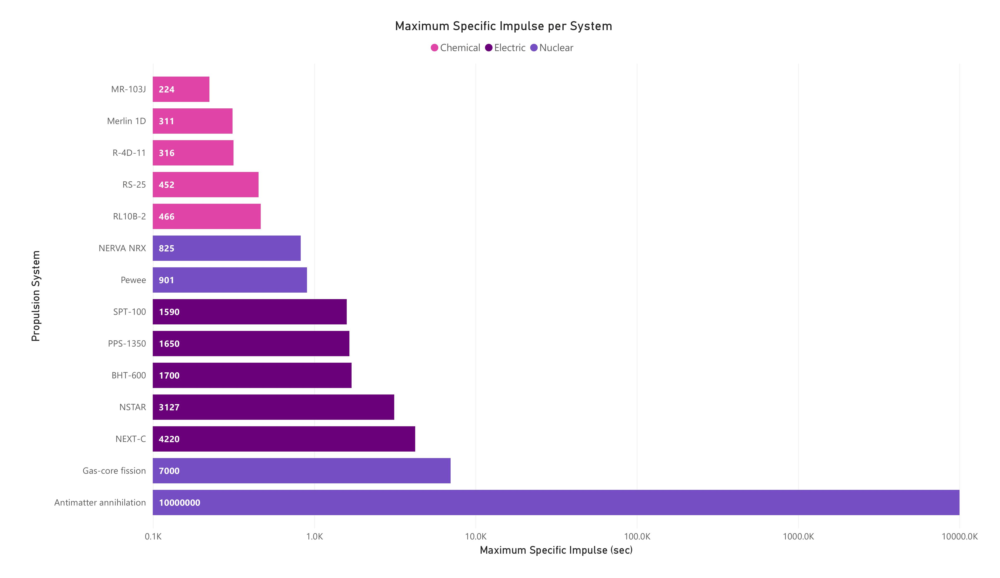

## Abstract

This analysis compares 15 spacecraft propulsion systems across three categories (chemical, electric, and nuclear) on specific impulse, maximum thrust, maximum input power, and thrust-to-weight ratio. The original question asked which propulsion system was the best. No system is best in the abstract: each category is suited to a different mission role, and ranking the systems on any single metric produces a misleading answer. Every figure in the dataset carries its own citation, page number, and a verbatim quote of the sentence it was read from.

---

## Questions

1. Which mission role is each category of propulsion best suited for?
2. Is ranking propulsion systems by specific impulse alone a valid method?

## Systems

| System | Category | Subtype | Role | Maturity | Flown |
|---|---|---|---|---|---|
| RS-25 | Chemical | Cryogenic bipropellant | Launch | Proven | Yes |
| RL10B-2 | Chemical | Cryogenic bipropellant | Upper stage | Proven | Yes |
| Merlin 1D | Chemical | Kerolox bipropellant | Launch | Proven | Yes |
| R-4D-11 | Chemical | Storable bipropellant | Orbit raising | Proven | Yes |
| MR-103J | Chemical | Monopropellant | Attitude control | Proven | Yes |
| NSTAR | Electric | Gridded ion | Deep space primary | Proven | Yes |
| NEXT-C | Electric | Gridded ion | Deep space primary | Proven | Yes |
| SPT-100 | Electric | Hall effect | Station keeping | Proven | Yes |
| PPS-1350 | Electric | Hall effect | Orbit raising | Proven | Yes |
| BHT-600 | Electric | Hall effect | Station keeping | Proven | Yes |
| NERVA NRX | Nuclear | Nuclear thermal | Upper stage | Ground tested | No |
| Pewee | Nuclear | Nuclear thermal | Upper stage | Ground tested | No |
| DRACO | Nuclear | Nuclear thermal | Upper stage | Prototype (cancelled 2025) | No |
| Gas-core fission | Nuclear | Nuclear thermal (gas core) | Deep space primary | Theoretical | No |
| Antimatter annihilation | Nuclear | Antimatter annihilation | Deep space primary | Theoretical | No |

## Metrics

- Maximum specific impulse (Isp, seconds): a measure of propellant efficiency, being the thrust produced per unit of propellant weight consumed per second. A higher figure means more total impulse from the same mass of propellant. The unit is seconds, but it is not a burn time.
- Maximum thrust (N): the largest force the engine can produce.
- Maximum input power (kW): the electrical power required to run the engine. Applies only to electric systems.
- Maximum thrust-to-weight ratio: thrust divided by engine weight. A ratio above 1 means the engine can lift its own weight, which is the minimum condition for launching from within an atmosphere.

---

## Question 1: Mission Roles by Category

### Chemical

Chemical systems are the only category with hardware that has both flown and produced a thrust-to-weight ratio above 1. They achieve this with large thrust and low specific impulse, meaning they can produce very large forces but cannot sustain them for long.



The five chemical systems span roughly six orders of magnitude in thrust (1.19 N to 2.28 million N) inside a specific impulse band of only 202 to 466 seconds. That spread is the important result: the category is not one thing.



| System | Role | Max thrust (N) | Max Isp (s) | Max T/W |
|---|---|---:|---:|---:|
| RS-25 | Launch | 2,278,695 | 452.0 | 66.12 |
| RL10B-2 | Upper stage | 110,094 | 465.5 | 37.27 |
| Merlin 1D | Launch | 716,164 | 311.0 | not computable |
| R-4D-11 | Orbit raising | 511 | 315.5 | 13.86 |
| MR-103J | Attitude control | 1.19 | 224.0 | 0.33 |

The statement "chemical propulsion is what launches rockets" is too coarse to be useful. The MR-103J is a flight proven chemical thruster with a maximum thrust-to-weight ratio of 0.33, meaning it cannot lift its own weight off the ground. It has flown on real spacecraft for decades performing attitude (orientation) control. Chemical propulsion is the only category currently launching anything, but only part of the category can launch at all.

Merlin 1D is excluded from the thrust-to-weight chart because no citable engine dry mass could be found for it. That exclusion is noted on the chart rather than hidden.

### Electric

Electric systems cannot escape an atmosphere. Their maximum thrust across all five systems is 0.235 N, roughly the weight of an apple held in the hand. What they offer instead is efficiency: specific impulses of 1,220 to 4,220 seconds, between three and nine times the best chemical figure.



Compare this chart against the chemical one directly above it. The axes are the same. Chemical systems occupy the high thrust, low efficiency corner; electric systems occupy the opposite one. Neither is an upgrade over the other.



| System | Role | Max thrust (N) | Max Isp (s) | Max input power (kW) |
|---|---|---:|---:|---:|
| NEXT-C | Deep space primary | 0.235 | 4,220 | 6.85 |
| SPT-100 | Station keeping | 0.097 | 1,590 | 1.50 |
| NSTAR | Deep space primary | 0.093 | 3,127 | 2.33 |
| PPS-1350 | Orbit raising | 0.088 | 1,650 | 1.19 |
| BHT-600 | Station keeping | 0.039 | 1,700 | 0.80 |

Thrust tracks input power closely across all five systems. This is the practical constraint on electric propulsion: thrust is bounded by the electrical power a spacecraft can generate and dissipate, so an electric propulsion decision is as much a spacecraft power and thermal decision as a thruster decision.

Electric systems suit roles where time is available and propellant mass is the binding constraint: station keeping on satellites, orbit raising, and deep space primary propulsion.

### Nuclear

Nuclear systems occupy an attractive middle position, and nothing in the category has ever flown.



The chart is presented in two panels because the category divides cleanly in two.

| System | Maturity | Max thrust (N) | Max Isp (s) | Max T/W |
|---|---|---:|---:|---:|
| NERVA NRX | Ground tested | 333,000 | 825 | 3.27 |
| Pewee | Ground tested | 111,206 | 901 | not computable |
| DRACO | Prototype, cancelled | no data | no data | no data |
| Gas-core fission | Theoretical | no data | 7,000 | no data |
| Antimatter annihilation | Theoretical | no data | 10,000,000 | no data |

The two systems that were actually built (NERVA NRX and Pewee) achieve roughly double the specific impulse of the best chemical engine while producing thrust in the hundreds of kilonewtons. NERVA NRX computes to a thrust-to-weight ratio of 3.27, which is above the launch threshold. That figure comes from ground testing during the Rover and NERVA programmes; the engine never flew, and there are separate and reasonable objections to operating a fission reactor inside an atmosphere.

The right panel carries no thrust data at all, which is labelled on the chart. The two theoretical systems have a published specific impulse and nothing else.

DRACO is the only nuclear thermal system that was being built to fly. It was cancelled in 2025 having published no performance figure at any source tier, which is why its row is empty. In a dataset where every other value carries a quote, an empty row is itself information and is kept rather than dropped.

---

## Question 2: Ranking by Specific Impulse

The original class project ranked 30 propulsion methods by specific impulse and declared a winner. That method does not work, and this chart is sorted by the exact metric it discredits.



Read as a league table, the chart says antimatter annihilation wins by four orders of magnitude. Two problems:

1. The two highest ranked systems have never been built. Antimatter annihilation at 10,000,000 seconds is roughly 2,370 times NEXT-C at 4,220 seconds, which is the highest specific impulse any hardware has ever achieved. Gas-core fission at 7,000 seconds has never been built either.
2. Specific impulse says nothing about whether a system can perform a given job. The MR-103J and the RS-25 differ by a factor of two on specific impulse and by a factor of nearly two million on thrust.

A metric can be perfectly meaningful and still produce a meaningless ranking when the population being ranked mixes hardware that exists with concepts that do not. The fix is not a better metric. It is a maturity column, which this dataset carries and the original did not.

### Thrust-to-weight is computable for only 8 of 15 systems

Twelve systems have a citable thrust figure. Eight have a citable engine mass. Thrust-to-weight requires both, so it can be calculated for 8 systems out of 15.

The metric that answers the question most people actually ask (can this leave the ground) is the one the literature is least willing to supply. Specific impulse is a clean property of the exhaust and is published everywhere. Engine dry mass is a programme detail that frequently stays with the contractor. Merlin 1D is the clearest case: a famous, flown, commercially successful engine with no citable dry mass.

---

## Data Quality Findings

### A unit error in the primary source

The original class project drew its figures from Frisbee (2003), "Advanced Space Propulsion for the 21st Century", Journal of Propulsion and Power 19(6). Table 3 of that paper gives antimatter annihilation an exhaust velocity of 10^8 km/s, which is 333 times the speed of light.

The table's own conversion factor holds for its first three rows and fails for the last three, each by exactly 1000 times. The body text of the same paper gives the correct figure of 10^4 km/s, with the author's own sanity check that this is "3% of the speed of light". The paper contradicts itself, and the prose is right.

The original transcription was faithful. The error is upstream, in a peer reviewed paper. This rebuild avoids it by reading specific impulse from the table's other column, which is internally consistent.

This is why `src/clean.py` asserts that no exhaust velocity exceeds the speed of light. A correctly quoted figure from a reputable source can still be wrong, and no amount of citation checking will catch it. Only a physics bound will. Validating that a value is correctly transcribed and validating that it is physically possible are two different tests, and this dataset runs both.

### Sources that disagree

Conflicts are recorded rather than resolved by preference:

- RS-25 dry mass differs by 10% between NASA's own technical report (7,748 lb) and secondary sources (7,004 lb). The NASA figure is used, which moves the engine's thrust-to-weight from the commonly quoted 73 down to a range of 61 to 66.
- BHT-600 input power has two citable and different ranges: 200 to 800 W in a NASA and Busek paper, 300 to 800 W on Busek's own datasheet. Both are stored, as two rows against two sources.
- PPS-1350 nominal power is given as 1500 W in a table and 1.35 kW in the facing body text of the same book. Neither was used. The in-flight throttle range, corroborated by an independent ESA and AIAA source, was used instead.

---

## Sources

There is no single authority publishing every figure on a schedule, as IPEDS does for higher education. The substitute is a documented source hierarchy plus a citation on every individual value.

| Tier | What it is | Citable as primary? |
|---|---|---|
| 1, Authoritative | Peer reviewed papers; NASA, JPL and ESA technical reports (NTRS, TM, CR); Los Alamos reports | Yes |
| 2, Primary vendor | Manufacturer datasheets (Aerojet Rocketdyne and L3Harris, Busek, SpaceX) | Yes, recorded as vendor sourced |
| 3, Aggregator | Wikipedia, Encyclopedia Astronautica, AI generated encyclopedias | No. Used only to locate a Tier 1 or Tier 2 source, which is then read and cited directly |

40 cited figures from 15 documents: 10 Tier 1 (8 agency, 2 peer reviewed) and 5 Tier 2 vendor.

`sources.csv` declares 22 documents rather than 15. The other seven were read during collection but no figure ultimately rests on them, because in each case another source was cited for the same system. They are kept rather than deleted: what was read and not used is part of the audit trail, and removing it would make the collection look tidier than it was. All seven are Tier 1, and six carry a DOI or NTRS link.

The rule that does the real work is simpler than the hierarchy: no verbatim quote, no row. A figure that cannot be traced to a sentence does not enter the dataset. That rule is enforced in code by `src/verify_sources.py`, which refuses to run if any measurement lacks a quote or a location.

The `local_file` column in `sources.csv` records which document a figure was read from during collection. Those documents are not redistributed in this repository, because they are third party papers and at least one sits behind a publisher paywall. Follow the `url` on the same row to reach the source itself.

## Verification

Most of this collection was performed with AI assistance, which cannot verify its own claims. Four independent checks exist because of that:

| Check | What it catches |
|---|---|
| `output/verification_checklist.md`, every figure with its quote and page, grouped by source | Misquotation, wrong page, fabrication |
| Independent re-extraction by a different model family, prompted without stating the expected answer | Misread table, wrong row or column |
| Physics bounds in `src/clean.py` | Unit errors, which a citation check cannot catch because the number really was published |
| Row count assertions at every stage | Silent partial loads |

The cross-check confirmed all 5 figures drawn from local PDFs exactly. It also surfaced evidence the first pass had missed: the body text passage proving the Frisbee table error. 35 of 40 figures are hand-check-only and are marked as such in the checklist. They should not inherit the confidence of the cross-checked rows.

The last row of that table earned its place. Six measurements were silently rejected during the database import for exceeding a column width. MySQL rejects an over-length row rather than truncating it, and reports nothing. Only a row count assertion caught it. Had it not, the analysis would have run on 34 of 40 figures and produced entirely plausible, wrong results.

---

## Limitations

1. Nuclear and chemical specific impulses rest on different bases. Pewee's 865 to 901 seconds is ideal vacuum performance, calculated assuming infinite nozzle expansion and no losses. The RS-25's 452 seconds is delivered performance. The nuclear advantage is real, but these numbers overstate it.
2. NERVA NRX's thrust-to-weight ratio of 3.27 comes from ground testing, not flight. No nuclear system has ever flown, so no nuclear figure in this dataset has been validated in an operational environment.
3. Thrust-to-weight is computable for only 8 of 15 systems, so the metric most relevant to launch capability covers just over half the dataset.
4. Every published range was collapsed to its maximum for the headline comparison. Every figure quoted here is therefore a best case, and the underlying schema stores the full range rather than the maximum.
5. Frisbee (2003) is 22 years old and remains the only source for the theoretical concepts. Nothing more recent publishes comparable figures for them.
6. Vendor datasheets are promotional documents. They are recorded as Tier 2 and flagged in the data rather than treated as equivalent to agency reports.
7. Theoretical systems have one number and no engineering behind them. They appear on the specific impulse chart and nowhere else, which is the honest treatment.
8. Electric thruster mass excludes the power processing unit, solar arrays, and radiators, which dominate the mass of a real electric propulsion system. Electric thrust-to-weight is therefore flattered, although it is of order 0.0001 either way, so no conclusion here depends on it.
9. 35 of 40 figures have not been independently re-extracted and rest on a single reading of a single source.
10. 15 systems is a purposive selection, not a sample. The systems were chosen to cover the three categories and the range of mission roles, not drawn at random, so nothing here generalises to propulsion as a field.
11. No per-system cost figure exists in any consulted source, which is why the original question was retired.

---

## Repository

```
data/processed/     cleaned CSVs, plus import files for MySQL
data/raw/           hand-built measurements.csv, one row per cited figure
sql/                schema.sql, analysis.sql
src/                clean, verify_sources, load, verify_load, analyze, viz, excel_report
powerbi/            PropulsionAnalysis.pbix and PropulsionAnalysis.pdf
docs/               data collection, SQL primer, MySQL setup, Workbench import, pandas, Power BI
```

Schema is three tables, because sources disagree and every figure needs its own citation:

```
propulsion_system   15 rows, what is being compared
source              22 rows, where figures came from
measurement         40 rows, one published figure with page and quote
```

Values are stored as `value_low` and `value_high` ranges, never as single numbers. Collapsing a published range to its maximum is the defect that corrupted the original dataset, and the schema makes repeating it impossible. Derived metrics such as thrust-to-weight are computed in pandas and never stored, so every row in `measurement` remains something a source actually published.

Reproduction requires Python 3.14 and MySQL 8.0 or later.

```bash
python src/clean.py            # validate raw CSVs, write import files
python src/verify_sources.py   # check traceability, write the checklist
```

Then create the database and import the three CSVs from `data/processed/import/` following `docs/workbench-import.md`, and:

```bash
python src/verify_load.py      # confirm the import
python src/analyze.py          # findings and analysis.csv
python src/viz.py              # the four charts
python src/excel_report.py     # the workbook
python -m pytest tests/ -v     # 26 tests
```

## Background

This project rebuilds a Database Management Systems class project that compared 30 propulsion methods on specific impulse alone. The original dataset was lost. Only a list of methods and figures survived, which was traced back to a single 2003 paper with each published range collapsed to its maximum.

The reconstruction changes the question. The original statement asked for the most cost-effective system, but no per-system cost figure exists in any consulted source, and none exists publicly for the theoretical concepts. The only dollar amounts available anywhere are programme level (7 billion for Project Rover, 11 million for ORION) and a generic launch cost of 10,000 per kilogram. Rather than answer that question badly, this study asks what each category is for. Both statements are recorded in `Project Statement.txt`.
